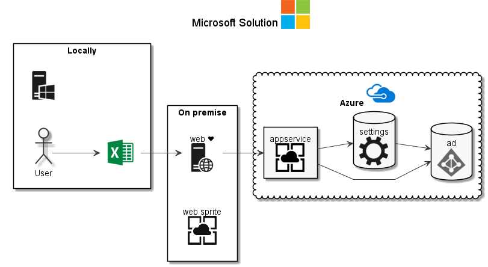
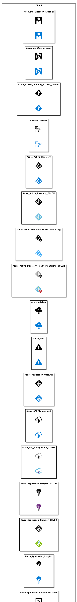
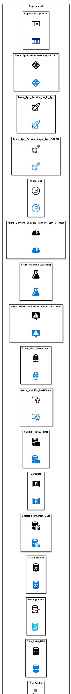
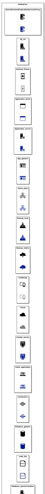
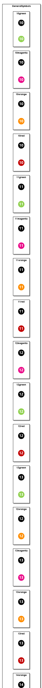
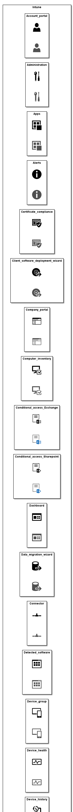
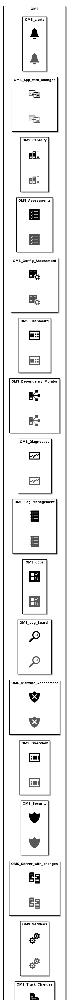
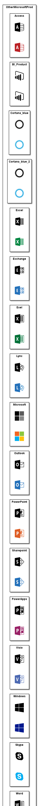
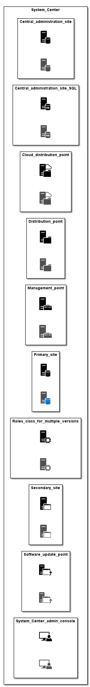

# Samples

See the various samples:

* [azure](azure.puml)
* [Cloud](Cloud.puml)
* [Deprecated](Deprecated.puml)
* [Enterprise](Enterprise.puml)
* [GeneralSymbols](GeneralSymbols.puml)
* [Intune](Intune.puml)
* [OMS](OMS.puml)
* [OtherMicrosoftProd](OtherMicrosoftProd.puml)
* [styling](styling.puml)
* [System_Center](System_Center.puml)

## Content of samples

### azure

### Cloud

### Deprecated

### Enterprise

### GeneralSymbols

### Intune

### OMS

### OtherMicrosoftProd

### styling

### System_Center

