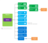
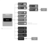

# Cloud

|   |   |   |   |
|---|---|---|---|
| Accounts_Microsoft_account.puml |  |  |  | 
| Accounts_Work_account.puml |  |  |  | 
| Analysis_Service.puml |  |  |  | 
| Azure_Acitve_Directory_Access_Control.puml |  |  |  | 
| Azure_Active_Directory.puml |  |  |  | 
| Azure_Active_Directory_COLOR.puml |  |  |  | 
| Azure_Active_Directory_Health_Monitoring.puml |  |  |  | 
| Azure_Active_Directory_Health_monitoring_COLOR.puml |  |  |  | 
| Azure_Advisor.puml |  |  |  | 
| Azure_alert.puml |  |  |  | 
| Azure_API_Management.puml |  |  |  | 
| Azure_API_Management_COLOR.puml |  |  |  | 
| Azure_Application_Gateway.puml |  |  |  | 
| Azure_Application_Gateway_COLOR.puml |  |  |  | 
| Azure_Application_Insights.puml |  |  |  | 
| Azure_Application_Insights_COLOR.puml |  |  |  | 
| Azure_App_Service.puml |  |  |  | 
| Azure_App_Service_Azure_API_Apps.puml |  |  |  | 
| Azure_App_Service_Azure_API_Apps_COLOR.puml |  |  |  | 
| Azure_App_Service_COLOR.puml |  |  |  | 
| Azure_App_Service_Mobile_App_COLOR.puml |  |  |  | 
| Azure_App_Service_Mobile_App_was_Mobile_Services.puml |  |  |  | 
| Azure_App_Service_Web_App_COLOR.puml |  |  |  | 
| Azure_App_Service_Web_App_was_Websites.puml |  |  |  | 
| Azure_App_Service_Worker_Pools.puml |  |  |  | 
| Azure_App_Service_Worker_Pools_COLOR.puml |  |  |  | 
| Azure_Automation.puml |  |  |  | 
| Azure_Automation_COLOR.puml |  |  |  | 
| Azure_Automation_Runbooks.puml |  |  |  | 
| Azure_Automation_Runbooks_COLOR.puml |  |  |  | 
| Azure_Backup.puml |  |  |  | 
| Azure_Backup_Backup_Agent.puml |  |  |  | 
| Azure_Backup_COLOR.puml |  |  |  | 
| Azure_Backup_Recovery_Vault.puml |  |  |  | 
| Azure_Batch.puml |  |  |  | 
| Azure_BizTalk_Services.puml |  |  |  | 
| Azure_BizTalk_Services_COLOR.puml |  |  |  | 
| Azure_BizTalk_Services_Hybrid_Connections.puml |  |  |  | 
| Azure_BizTalk_Services_Hybrid_Connections_COLOR.puml |  |  |  | 
| Azure_BizTalk_Services_Hybrid_connection_manager.puml |  |  |  | 
| Azure_Cache_including_Redis.puml |  |  |  | 
| Azure_Cache_including_Redis_COLOR.puml |  |  |  | 
| Azure_Cache_Redis_Product_icon_COLOR.puml |  |  |  | 
| Azure_Cloud_Service.puml |  |  |  | 
| Azure_Cloud_Services_Web_role.puml |  |  |  | 
| Azure_Cloud_Services_Web_roles.puml |  |  |  | 
| Azure_Cloud_Services_Worker_role.puml |  |  |  | 
| Azure_Cloud_Services_Worker_roles.puml |  |  |  | 
| Azure_Cloud_Service_COLOR.puml |  |  |  | 
| Azure_Cognative_Services_COLOR.puml |  |  |  | 
| Azure_Cognative_Services_Computer_Vision_COLOR.puml |  |  |  | 
| Azure_Cognative_Services_emotion_COLOR.puml |  |  |  | 
| Azure_Cognative_Services_luis_COLOR.puml |  |  |  | 
| Azure_Cognative_Services_recommendations_COLOR.puml |  |  |  | 
| Azure_Cognative_Services_Speech_COLOR.puml |  |  |  | 
| Azure_Cognative_Services_textanalytics_COLOR.puml |  |  |  | 
| Azure_Cognative_Services_web_language_model_COLOR.puml |  |  |  | 
| Azure_Cognitive_Services.puml |  |  |  | 
| Azure_Compute_Autoscaling.puml |  |  |  | 
| Azure_Container_Service.puml |  |  |  | 
| Azure_Container_Service_COLOR.puml |  |  |  | 
| Azure_Content_Delivery_Network_CDN.puml |  |  |  | 
| Azure_Content_Delivery_Network_CDN_COLOR.puml |  |  |  | 
| Azure_Cortona_Management_Suite.puml |  |  |  | 
| Azure_Database_General_COLOR.puml |  |  |  | 
| Azure_DataServices_category_rollup.puml |  |  |  | 
| Azure_Data_Catalog.puml |  |  |  | 
| Azure_Data_Catalog_COLOR.puml |  |  |  | 
| Azure_Data_Factory.puml |  |  |  | 
| Azure_Data_Factory_COLOR.puml |  |  |  | 
| Azure_Data_Lake.puml |  |  |  | 
| Azure_Data_Lake_Analytics.puml |  |  |  | 
| Azure_Data_Lake_Analytics_COLOR.puml |  |  |  | 
| Azure_Data_Lake_Store.puml |  |  |  | 
| Azure_Data_Lake_Store_COLOR.puml |  |  |  | 
| Azure_Data_Warehouse.puml |  |  |  | 
| Azure_Data_Warehouse_COLOR.puml |  |  |  | 
| Azure_DevTest_Labs.puml |  |  |  | 
| Azure_DevTest_Labs_COLOR.puml |  |  |  | 
| Azure_DNS.puml |  |  |  | 
| Azure_DNS_COLOR.puml |  |  |  | 
| Azure_DocumentDB.puml |  |  |  | 
| Azure_DocumentDB_COLOR.puml |  |  |  | 
| Azure_DocumentDB_database.puml |  |  |  | 
| Azure_DocumentDB_DocDB_account.puml |  |  |  | 
| Azure_DocumentDB_DocDB_collections_1.puml |  |  |  | 
| Azure_DocumentDB_document_2.puml |  |  |  | 
| Azure_Event_Hubs.puml |  |  |  | 
| Azure_Event_Hubs_COLOR.puml |  |  |  | 
| Azure_ExpressRoute.puml |  |  |  | 
| Azure_Express_Route_COLOR.puml |  |  |  | 
| Azure_Functions.puml |  |  |  | 
| Azure_Functions_COLOR.puml |  |  |  | 
| Azure_HDInsight.puml |  |  |  | 
| Azure_HDInsight_COLOR.puml |  |  |  | 
| Azure_HockeyApp.puml |  |  |  | 
| Azure_HockeyApp_COLOR.puml |  |  |  | 
| Azure_IoTHub_COLOR.puml |  |  |  | 
| Azure_IoT_Hub.puml |  |  |  | 
| Azure_KeyVault_COLOR.puml |  |  |  | 
| Azure_Key_Vault.puml |  |  |  | 
| Azure_load_balancer_automatic.puml |  |  |  | 
| Azure_Load_Balancer_feature.puml |  |  |  | 
| Azure_Load_Balancer_feature_COLOR.puml |  |  |  | 
| Azure_Machine_Learning.puml |  |  |  | 
| Azure_Machine_Learning_COLOR.puml |  |  |  | 
| Azure_Management_Portal.puml |  |  |  | 
| Azure_Management_Portal_COLOR.puml |  |  |  | 
| Azure_Media_Services.puml |  |  |  | 
| Azure_Media_Services_COLOR.puml |  |  |  | 
| Azure_Mobile_Engagement.puml |  |  |  | 
| Azure_Mobile_Engagement_COLOR.puml |  |  |  | 
| Azure_Multi_Factor_Authentication.puml |  |  |  | 
| Azure_Multi_Factor_Authentication_COLOR.puml |  |  |  | 
| Azure_MySQL_ClearDB_database.puml |  |  |  | 
| Azure_MySQL_ClearDB_database_COLOR.puml |  |  |  | 
| Azure_Notification_Hubs.puml |  |  |  | 
| Azure_Notification_Hubs_COLOR.puml |  |  |  | 
| Azure_RemoteApp.puml |  |  |  | 
| Azure_RemoteApp_COLOR.puml |  |  |  | 
| Azure_Rights_Management_RMS.puml |  |  |  | 
| Azure_Scheduler.puml |  |  |  | 
| Azure_SDK.puml |  |  |  | 
| Azure_SDK_COLOR.puml |  |  |  | 
| Azure_Search.puml |  |  |  | 
| Azure_Search_COLOR.puml |  |  |  | 
| Azure_Security_Center.puml |  |  |  | 
| Azure_Security_Center_COLOR.puml |  |  |  | 
| Azure_Service_Bus.puml |  |  |  | 
| Azure_Service_Bus_COLOR.puml |  |  |  | 
| Azure_Service_Bus_Queues.puml |  |  |  | 
| Azure_Service_Bus_Queues_COLOR.puml |  |  |  | 
| Azure_Service_Bus_Relay.puml |  |  |  | 
| Azure_Service_Bus_Topics.puml |  |  |  | 
| Azure_Service_Bus_Topics_COLOR.puml |  |  |  | 
| Azure_Service_Fabric.puml |  |  |  | 
| Azure_Service_Fabric_COLOR.puml |  |  |  | 
| Azure_Site_Recovery.puml |  |  |  | 
| Azure_Site_Recovery_COLOR.puml |  |  |  | 
| Azure_SQL_Database.puml |  |  |  | 
| Azure_SQL_Database_generic.puml |  |  |  | 
| Azure_SQL_Database_generic_COLOR.puml |  |  |  | 
| Azure_SQL_Database_Premium.puml |  |  |  | 
| Azure_SQL_DataSync.puml |  |  |  | 
| Azure_SQL_DataWarehouse.puml |  |  |  | 
| Azure_SQL_DataWarehouse_COLOR.puml |  |  |  | 
| Azure_SQL_Stretch_Database.puml |  |  |  | 
| Azure_SQL_Stretch_Database_COLOR.puml |  |  |  | 
| Azure_Stack.puml |  |  |  | 
| Azure_Storage.puml |  |  |  | 
| Azure_Storage_Blob.puml |  |  |  | 
| Azure_Storage_Files.puml |  |  |  | 
| Azure_Storage_Queue.puml |  |  |  | 
| Azure_Storage_Table.puml |  |  |  | 
| Azure_Store.puml |  |  |  | 
| Azure_Store_Marketplace.puml |  |  |  | 
| Azure_Store_Marketplace_COLOR.puml |  |  |  | 
| Azure_StorSimple.puml |  |  |  | 
| Azure_StorSimple_COLOR.puml |  |  |  | 
| Azure_Stream_Analytics.puml |  |  |  | 
| Azure_Stream_Analytics_COLOR.puml |  |  |  | 
| Azure_subscription.puml |  |  |  | 
| Azure_Traffic_Manager.puml |  |  |  | 
| Azure_Traffic_Manager_COLOR.puml |  |  |  | 
| Azure_Virtual_Machine.puml |  |  |  | 
| Azure_Virtual_Machines_Availability_Set.puml |  |  |  | 
| Azure_Virtual_Machines_Availability_Set_COLOR.puml |  |  |  | 
| Azure_Virtual_Machines_Linux_Penguin_shadow_COLOR.puml |  |  |  | 
| Azure_Virtual_Machine_2_COLOR.puml |  |  |  | 
| Azure_Virtual_Machine_COLOR.puml |  |  |  | 
| Azure_Virtual_Network.puml |  |  |  | 
| Azure_Virtual_Network_COLOR.puml |  |  |  | 
| Azure_VM_container.puml |  |  |  | 
| Azure_VM_Scale_Set.puml |  |  |  | 
| Azure_VM_Scale_Set_COLOR.puml |  |  |  | 
| Azure_VM_symbol_only.puml |  |  |  | 
| Azure_VPN_Gateway.puml |  |  |  | 
| Azure_VPN_Gateway_color.puml |  |  |  | 
| Azure_WebApp_WebJobs.puml |  |  |  | 
| Azure_WebApp_WebJobs_COLOR.puml |  |  |  | 
| Bot_Services.puml |  |  |  | 
| Cloud_Office_365.puml |  |  |  | 
| Container_Service.puml |  |  |  | 
| Logic_Apps.puml |  |  |  | 
| Logic_Apps_COLOR.puml |  |  |  | 
| Microsoft_Azure.puml |  |  |  | 
| Monitor.puml |  |  |  | 
| Network_Security_Group.puml |  |  |  | 
| Network_Security_Group_COLOR.puml |  |  |  | 
| NewArt_NativeSize.puml |  |  |  | 
| Office_365.puml |  |  |  | 
| Office_365_subscription.puml |  |  |  | 
| OMS_Log_Analytics.puml |  |  |  | 
| Operations_Management_Suite_OMS.puml |  |  |  | 
| Operations_Management_Suite_OMS_COLOR.puml |  |  |  | 
| OS_image.puml |  |  |  | 
| Power_BI_Embedded.puml |  |  |  | 
| ResourceGroup_COLOR.puml |  |  |  | 
| Resource_Group.puml |  |  |  | 
| Service_Bus.puml |  |  |  | 
| Service_Endpoint.puml |  |  |  | 
| SQL_Database_Pools.puml |  |  |  | 
| SQL_Elastic_Pools.puml |  |  |  | 
| Storage.puml |  |  |  | 
| Unidentified_feature_object.puml |  |  |  | 
| Unidentified_feature_object_COLOR.puml |  |  |  | 
| VHD.puml |  |  |  | 
| VHD_data_disk.puml |  |  |  | 
| Visual_Studio_Team_Services.puml |  |  |  | 
| Visual_Studio_Team_Services_Bitbucket_code_source.puml |  |  |  | 
| Visual_Studio_Team_Services_Bitbucket_code_source_COLOR.puml |  |  |  | 
| Visual_Studio_Team_Services_CodePlex_source.puml |  |  |  | 
| Visual_Studio_Team_Services_CodePlex_source_COLOR.puml |  |  |  | 
| Visual_Studio_Team_Services_COLOR.puml |  |  |  | 
| Visual_Studio_Team_Services_Dropbox_code_source.puml |  |  |  | 
| Visual_Studio_Team_Services_Dropbox_code_source_COLOR.puml |  |  |  | 
| Visual_Studio_Team_Services_GitHub.puml |  |  |  | 
| Visual_Studio_Team_Services_GitHub_COLOR.puml |  |  |  | 
| Visual_Studio_Team_Services_Git_repository.puml |  |  |  | 
| Visual_Studio_Team_Services_Git_repository_COLOR.puml |  |  |  | 
| webhooks.puml |  |  |  | 
| webhooks_COLOR.puml |  |  |  | 
| webhooks_mono.puml |  |  |  | 
