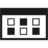
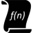

# Enterprise

|   |   |   |   |
|---|---|---|---|
| ActiveDirectoryFederationServicesProxy.puml |  |  |  | 
| AD_FS.puml |  |  |  | 
| Android_Phone.puml |  |  |  | 
| Application_blank.puml |  |  |  | 
| Application_server.puml |  |  |  | 
| App_generic.puml |  |  |  | 
| Azure_pack.puml |  |  |  | 
| Backup_local.puml |  |  |  | 
| Backup_online.puml |  |  |  | 
| Certificate.puml |  |  |  | 
| Client_application.puml |  |  |  | 
| Cloud.puml |  |  |  | 
| Cluster_server.puml |  |  |  | 
| code_file.puml |  |  |  | 
| Connectors.puml |  |  |  | 
| Database_generic.puml |  |  |  | 
| Database_server.puml |  |  |  | 
| Database_synchronization.puml |  |  |  | 
| Device.puml |  |  |  | 
| Direct_Access_feature.puml |  |  |  | 
| Document.puml |  |  |  | 
| Domain_controller.puml |  |  |  | 
| Enterprise_Building.puml |  |  |  | 
| File_general.puml |  |  |  | 
| Filter.puml |  |  |  | 
| Firewall.puml |  |  |  | 
| Folder.puml |  |  |  | 
| Gateway.puml |  |  |  | 
| Generic_code.puml |  |  |  | 
| Healthy.puml |  |  |  | 
| Healthy_grey.puml |  |  |  | 
| Health_monitoring.puml |  |  |  | 
| Import_generic.puml |  |  |  | 
| Internet.puml |  |  |  | 
| Internet_hollow.puml |  |  |  | 
| Keyboard.puml |  |  |  | 
| Key_permissions.puml |  |  |  | 
| Laptop_computer.puml |  |  |  | 
| Load_balancer_Generic.puml |  |  |  | 
| Load_balancer_Generic_white.puml |  |  |  | 
| Load_Testing.puml |  |  |  | 
| Lock_protected.puml |  |  |  | 
| lock_unlocked_accessible.puml |  |  |  | 
| Maintenance.puml |  |  |  | 
| Management_console.puml |  |  |  | 
| Message.puml |  |  |  | 
| Monitor.puml |  |  |  | 
| Monitor_running_apps.puml |  |  |  | 
| Mouse.puml |  |  |  | 
| Network_card.puml |  |  |  | 
| Not_allowed.puml |  |  |  | 
| Performance.puml |  |  |  | 
| Performance_monitor.puml |  |  |  | 
| Phone.puml |  |  |  | 
| Plug_and_play.puml |  |  |  | 
| Powershell_script_file.puml |  |  |  | 
| Protocol_stack.puml |  |  |  | 
| Queue_general.puml |  |  |  | 
| RMS_connector.puml |  |  |  | 
| Router.puml |  |  |  | 
| rpd_Remoting_file.puml |  |  |  | 
| Script_file.puml |  |  |  | 
| Secure_virtual_machine.puml |  |  |  | 
| Server_blade.puml |  |  |  | 
| Server_directory.puml |  |  |  | 
| Server_farm.puml |  |  |  | 
| Server_generic.puml |  |  |  | 
| Server_rack.puml |  |  |  | 
| Settings.puml |  |  |  | 
| Shared_folder.puml |  |  |  | 
| Smartcard.puml |  |  |  | 
| Startup_task.puml |  |  |  | 
| Storage.puml |  |  |  | 
| stored_procedures.puml |  |  |  | 
| Table.puml |  |  |  | 
| Tablet.puml |  |  |  | 
| Tool.puml |  |  |  | 
| triggers.puml |  |  |  | 
| Tunnel.puml |  |  |  | 
| UDF_Function.puml |  |  |  | 
| Unhealthy.puml |  |  |  | 
| USB.puml |  |  |  | 
| User_Enterprise.puml |  |  |  | 
| User_permissions.puml |  |  |  | 
| Video.puml |  |  |  | 
| Virtual_Machine.puml |  |  |  | 
| Web.puml |  |  |  | 
| WebSite_generic.puml |  |  |  | 
| Web_server.puml |  |  |  | 
| Windows_Server.puml |  |  |  | 
| Wireless_connection.puml |  |  |  | 
| Workstation_client.puml |  |  |  | 
| XML_web_service.puml |  |  |  | 
